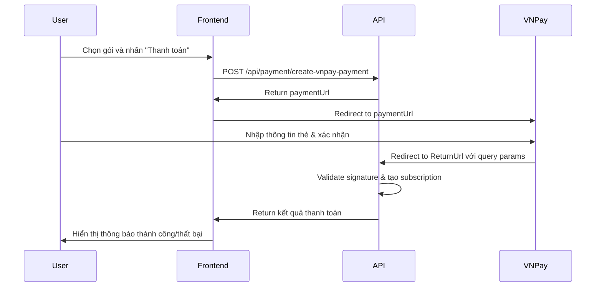

# Hướng dẫn tích hợp thanh toán VNPay cho MembershipPackage

## 📋 Tổng quan

API này đã được tích hợp VNPay để thanh toán cho các gói Membership Package. Khách hàng có thể thanh toán qua:
- VNPay QR
- Thẻ nội địa (ATM)
- Thẻ quốc tế (Visa/Master/JCB)

## 🔧 Cấu hình

### 1. Cập nhật appsettings.json

```json
"VnPay": {
  "Url": "https://sandbox.vnpayment.vn/paymentv2/vpcpay.html",
  "ReturnUrl": "https://your-domain.com/api/payment/vnpay-return",
  "TmnCode": "YOUR_TMN_CODE",
  "HashSecret": "YOUR_HASH_SECRET"
}
```

**Lưu ý:**
- `Url`: URL môi trường sandbox để test. Production: `https://vnpayment.vn/paymentv2/vpcpay.html`
- `ReturnUrl`: URL callback sau khi thanh toán (phải là URL public, không dùng localhost)
- `TmnCode`: Mã định danh merchant/website của bạn trên hệ thống VNPay (do VNPay cấp khi đăng ký)
- `HashSecret`: Chuỗi bí mật dùng để mã hóa và xác thực chữ ký (do VNPay tạo và cấp, KHÔNG được tự tạo)

### 2. Đăng ký tài khoản VNPay và lấy TmnCode/HashSecret

#### Môi trường Sandbox (Test)

**Bước 1: Đăng ký tài khoản**
1. Truy cập: https://sandbox.vnpayment.vn/devreg
2. Điền form đăng ký:
   - Email
   - Số điện thoại
   - Tên doanh nghiệp
   - Website (có thể điền demo)
3. Xác nhận email

**Bước 2: Lấy thông tin merchant**
1. Đăng nhập vào: https://sandbox.vnpayment.vn/merchantv2/
2. Vào menu: **Thông tin tài khoản** → **Cấu hình API**
3. Sẽ thấy thông tin:
   - **Website Code (TmnCode)**: Ví dụ: `DEMOSHOP` hoặc `ABCDEF01`
   - **Secret Key (HashSecret)**: Ví dụ: `ABCDEFGHIJKLMNOP1234567890QRSTUV`
4. Copy và paste vào `appsettings.json`

**Thông tin test mặc định (nếu dùng merchant demo):**
```json
"VnPay": {
  "TmnCode": "DEMOSHOP",
  "HashSecret": "RAOEXHYVSDDIIENYWSLDIIZTANXUXZFJ"
}
```
*Lưu ý: Thông tin trên là demo, bạn nên đăng ký để có merchant riêng*

#### Môi trường Production (Thật)

**Bước 1: Đăng ký chính thức**
1. Truy cập: https://vnpay.vn/
2. Liên hệ sale hoặc đăng ký online
3. Chuẩn bị hồ sơ:
   - Giấy phép kinh doanh
   - Hợp đồng mẫu
   - Chứng minh nhân thân người đại diện
   - Website/App đang vận hành

**Bước 2: Ký hợp đồng và tích hợp**
1. VNPAY sẽ review và phê duyệt
2. Ký hợp đồng dịch vụ
3. Nhận thông tin:
   - `TmnCode`: Mã merchant chính thức
   - `HashSecret`: Secret key production
4. Thay đổi URL từ sandbox sang production:
   ```json
   "Url": "https://vnpayment.vn/paymentv2/vpcpay.html"
   ```

**Chi phí:**
- Phí giao dịch: ~1.5-2.5% mỗi giao dịch
- Phí tích hợp: Tùy gói dịch vụ

---

### 3. Hướng dẫn test nhanh (không cần đăng ký)

**Nếu muốn test ngay mà chưa có tài khoản VNPay:**

Cập nhật `appsettings.json` với merchant demo của VNPay:
```json
"VnPay": {
  "Url": "https://sandbox.vnpayment.vn/paymentv2/vpcpay.html",
  "ReturnUrl": "http://localhost:5000/api/payment/vnpay-return",
  "TmnCode": "DEMOSHOP",
  "HashSecret": "RAOEXHYVSDDIIENYWSLDIIZTANXUXZFJ"
}
```

⚠️ **Lưu ý quan trọng:**
- Merchant demo này chỉ dùng để test flow, không dùng cho production
- Nên đăng ký tài khoản sandbox để có merchant riêng và kiểm soát tốt hơn
- `ReturnUrl` với localhost chỉ test được trên máy local, deploy production phải đổi sang URL public

**Tài khoản test VNPay (sandbox):**
- Ngân hàng: NCB
- Số thẻ: `9704198526191432198`
- Tên chủ thẻ: `NGUYEN VAN A`
- Ngày phát hành: `07/15`
- Mật khẩu OTP: `123456`

## 🚀 API Endpoints

### 1. Tạo URL thanh toán

**Endpoint:** `POST /api/payment/create-vnpay-payment`

**Authorization:** Bearer Token (Customer hoặc Admin)

**Request Body:**
```json
{
  "packageId": 1,
  "bankCode": "VNPAYQR",
  "locale": "vn"
}
```

**Parameters:**
- `packageId` (required): ID của gói membership
- `bankCode` (optional): Mã ngân hàng/phương thức thanh toán
  - `VNPAYQR`: QR Code
  - `VNBANK`: Thẻ nội địa/Internet Banking
  - `INTCARD`: Thẻ quốc tế
  - Để trống: Hiển thị tất cả phương thức
- `locale` (optional): Ngôn ngữ (`vn` hoặc `en`, mặc định `vn`)

**Response Success (200):**
```json
{
  "success": true,
  "paymentUrl": "https://sandbox.vnpayment.vn/paymentv2/vpcpay.html?vnp_Amount=...",
  "message": "Redirect to VNPay to pay 100,000 VND for package Premium",
  "orderId": "638123456789012345_1_1"
}
```

**Flow:**
1. Frontend gọi API này
2. Nhận `paymentUrl` từ response
3. Redirect user đến `paymentUrl`
4. User thanh toán trên cổng VNPay
5. VNPay redirect về `ReturnUrl` với kết quả

### 2. Callback sau thanh toán (Return URL)

**Endpoint:** `GET /api/payment/vnpay-return`

**Authorization:** Không cần (AllowAnonymous)

**Query Parameters:** Tự động từ VNPay

**Response Success (200):**
```json
{
  "success": true,
  "message": "Thanh toán thành công",
  "orderId": 638123456789012345,
  "vnPayTransactionId": 14123456,
  "responseCode": "00",
  "transactionStatus": "00",
  "amount": 100000,
  "bankCode": "NCB",
  "paymentDate": "2025-10-31T10:30:00",
  "subscription": {
    "subscriptionId": 10,
    "userId": 1,
    "username": "customer1",
    "packageId": 1,
    "packageName": "Premium",
    "startDate": "2025-10-31T10:30:00",
    "endDate": "2025-11-30T10:30:00",
    "status": "Active",
    "remainingGenerations": 100
  }
}
```

**Response Codes:**
- `00`: Giao dịch thành công
- `07`: Trừ tiền thành công. Giao dịch bị nghi ngờ (liên quan tới lừa đảo, giao dịch bất thường).
- `09`: Giao dịch không thành công do: Thẻ/Tài khoản của khách hàng chưa đăng ký dịch vụ InternetBanking tại ngân hàng.
- `10`: Giao dịch không thành công do: Khách hàng xác thực thông tin thẻ/tài khoản không đúng quá 3 lần
- `11`: Giao dịch không thành công do: Đã hết hạn chờ thanh toán. Xin quý khách vui lòng thực hiện lại giao dịch.
- `12`: Giao dịch không thành công do: Thẻ/Tài khoản của khách hàng bị khóa.
- `24`: Giao dịch không thành công do: Khách hàng hủy giao dịch

### 3. IPN (Instant Payment Notification)

**Endpoint:** `GET /api/payment/vnpay-ipn`

**Authorization:** Không cần

**Description:** Webhook để VNPay gọi lại xác nhận kết quả thanh toán (chạy background)

**Response:**
```json
{
  "RspCode": "00",
  "Message": "Confirm Success"
}
```

### 4. Kiểm tra trạng thái thanh toán

**Endpoint:** `GET /api/payment/payment-status/{orderId}`

**Authorization:** Bearer Token

**Response:**
```json
{
  "orderId": "638123456789012345_1_1",
  "hasActiveSubscription": true,
  "subscription": {
    "subscriptionId": 10,
    "userId": 1,
    "packageName": "Premium",
    "status": "Active"
  }
}
```

## 📱 Flow hoàn chỉnh

### Frontend Flow



### Ví dụ code Frontend (React/Next.js)

```typescript
// 1. Tạo payment URL
const createPayment = async (packageId: number) => {
  const response = await fetch('/api/payment/create-vnpay-payment', {
    method: 'POST',
    headers: {
      'Content-Type': 'application/json',
      'Authorization': `Bearer ${token}`
    },
    body: JSON.stringify({
      packageId: packageId,
      bankCode: 'VNPAYQR', // hoặc để trống
      locale: 'vn'
    })
  });
  
  const data = await response.json();
  
  if (data.success) {
    // Redirect đến VNPay
    window.location.href = data.paymentUrl;
  }
};

// 2. Xử lý callback (Return URL page)
// URL: /payment/result?vnp_ResponseCode=00&vnp_TxnRef=...
const PaymentResultPage = () => {
  const router = useRouter();
  const { vnp_ResponseCode, vnp_TxnRef } = router.query;
  
  useEffect(() => {
    // Gọi API backend để validate
    fetch(`/api/payment/vnpay-return${window.location.search}`)
      .then(res => res.json())
      .then(data => {
        if (data.success) {
          // Hiển thị thành công
          alert('Thanh toán thành công!');
          router.push('/dashboard');
        } else {
          // Hiển thị thất bại
          alert('Thanh toán thất bại: ' + data.message);
        }
      });
  }, []);
  
  return <div>Đang xử lý thanh toán...</div>;
};
```

## 🔒 Bảo mật

1. **HTTPS Required**: Production phải sử dụng HTTPS
2. **Signature Validation**: Mọi response từ VNPay đều được validate signature
3. **Order ID Format**: `{timestamp}_{userId}_{packageId}` - unique và traceable
4. **IP Address Logging**: Lưu IP của user khi tạo payment

## 🧪 Testing

### Test với Sandbox

1. Sử dụng thẻ test của VNPay (xem phần Cấu hình)
2. Môi trường: `https://sandbox.vnpayment.vn/`
3. Mã OTP test: `123456`

### Test Cases

1. ✅ Thanh toán thành công
2. ✅ Hủy thanh toán (vnp_ResponseCode = 24)
3. ✅ Thẻ không đủ số dư
4. ✅ Nhập sai OTP 3 lần
5. ✅ Timeout (hết hạn chờ)

## 🐛 Troubleshooting

### Lỗi "Invalid signature"
- Kiểm tra `HashSecret` trong config
- Đảm bảo không có space thừa
- Kiểm tra encoding (UTF-8)

### Callback không hoạt động
- `ReturnUrl` phải là URL public (không dùng localhost)
- Sử dụng ngrok để test local: `ngrok http 5000`
- Cập nhật ReturnUrl trong config VNPay

### Database không cập nhật subscription
- Kiểm tra log API
- Verify orderId format đúng
- Kiểm tra user và package tồn tại

## 📊 Database Schema

```sql
-- Payment transactions sẽ được lưu trong UserMembershipSubscription
-- với thông tin:
- SubscriptionId (PK)
- UserId (FK)
- PackageId (FK)
- StartDate
- EndDate
- Status (Active/Expired/Cancelled)
- CreatedAt (thời điểm thanh toán)
```

## 🔄 Migration từ Purchase trực tiếp

**Cũ:**
```
POST /api/membershippackage/purchase
-> Tạo subscription ngay lập tức (chưa thanh toán)
```

**Mới:**
```
POST /api/payment/create-vnpay-payment
-> Redirect đến VNPay
-> Thanh toán thành công
-> Tạo subscription
```

**Recommendation:**
- Giữ API cũ cho admin tạo subscription miễn phí
- User bình thường bắt buộc thanh toán qua VNPay

## 📞 Support

- VNPay Sandbox: https://sandbox.vnpayment.vn/
- VNPay Documentation: https://sandbox.vnpayment.vn/apis/
- VNPay Hotline: 1900 55 55 77

## 🎉 Demo URLs

- **API Base**: `https://your-domain.com/api`
- **Payment Flow**: `https://your-domain.com/api/payment/create-vnpay-payment`
- **Return URL**: `https://your-domain.com/api/payment/vnpay-return`
